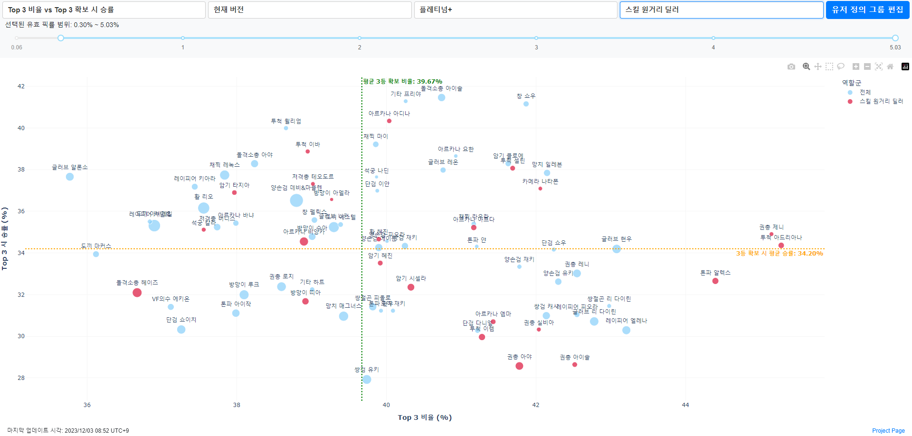

# ER Plot: ER Black Survival Rank Game Stats Visualization Tool
Live Server: **https://er-plot.xyz/**



This repository is dedicated to a non-commercial project for analyzing characters in the ranked games of Eternal Return Black Survival. Utilizing data from dak.gg, this system allows for interactive post-game analysis. It is not affiliated with, nor endorsed by [Nimble Neuron](https://nimbleneuron.com/) or [dak.gg](https://dak.gg/).

## Description

The project's goal is to provide an interactive platform for visual and statistical analysis of characters based on various performance metrics such as pick rate, win rate, Top 3 frequency, and RP gains.

Key Features:

- Interactive plots that visually compare characters based on pick rate, win rate, Top 3 finishes, and RP acquisition.
- Automatic updates every 3 hours to keep the data refresh. Data source is from [dak.gg](https://dak.gg/er/statistics).
- Comparative analysis across different game versions, tiers, and positions.
- Customization options for users to highlight groups of characters they are particularly interested in.
- Full advantage of plotly's capabilities: point hovering, zooming in/out, and more for an enhanced data visualization.
- Tracking of number of (estimated) active session.

## Installation

```bash
# Clone the repository
git clone https://github.com/mikigom/ER_plot

# Navigate to the repository directory
cd ER_plot

# Install required dependencies
pip install -r requirements.txt
```

## Usage

```bash
# Run the application
python run.py
```

This will launch a web service that serves the interactive data visualization interface.

## Contributing

Contributions are welcome! Please fork the repository and submit a pull request with your suggested changes.
Request for feature and bug report are also welcome but most immediate updates would be difficult due to my personal circumstances.
If you hope so, leave them as Issue.

## Credits

This tool was personally created by [@MikiBear_](https://twitter.com/MikiBear_) for users of Eternal Return Black Survival.

## License

This project is released under the MIT License - please see the LICENSE file for details.
